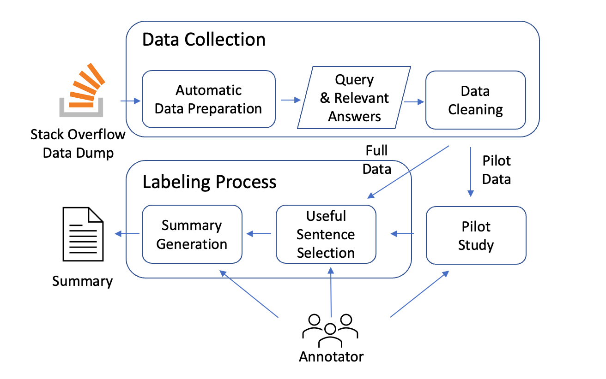

# Answer Summarization for Technical Queries: Benchmark and New Approach
This repository contains the code, pre-trained models, and Stack Overflow summarization benchmark for our paper: "Answer Summarization for Technical Queries: Benchmark and New Approach".
# Quick Link
# Overview
We construct the first summarization benchmark named TechSumBench for answer summarization of technical queries in SQA sites. 
The following figure is an illustration of our benchmark construction.

We also propose TechSumBot, a novel query-focused answer summarization approach with three modules to automatically generate answer summaries for techinal queries.

# Benchmark Data Field
We provide

# Getting Started
We provide the answer summarzation 

